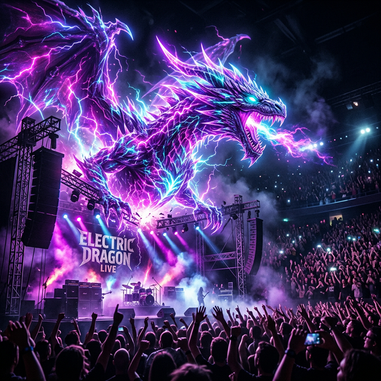

<p align="center">
  
</p>

<h1 align="center">🎸 PHOENIX LIVE '26 — Pune Arena</h1>

<p align="center">
  <strong>The Ultimate Rock Night Arena Experience</strong>
</p>

<p align="center">
  <a href="https://live-concert-event-landing-page.vercel.app/">
    
  </a>
  <a href="https://vishh70.github.io/Live-Concert-Event-Landing-Page/">
    
  </a>
  
  
  
  
</p>

<p align="center">
  
  
  
  
</p>

---

## 🎯 About

A **world-class**, dark-themed concert landing page for **Rock Night 2026** at Pune Arena. Built with zero frameworks — pure HTML, CSS, and JavaScript — delivering an estate-grade visual experience with cinematic animations, glassmorphic UI, and rich micro-interactions.

> 🏢 Built for the **CrescifyX** internship sprint deliverable  
> 📋 Maps to Jira tickets: `CIMS-14`, `CIMS-15`, `CIMS-16`

---

## ✨ Live Demo

🔗 **Primary (Vercel): [https://live-concert-event-landing-page.vercel.app/](https://live-concert-event-landing-page.vercel.app/)**  
🔗 **Mirror (GitHub): [https://vishh70.github.io/Live-Concert-Event-Landing-Page/](https://vishh70.github.io/Live-Concert-Event-Landing-Page/)**

> If the site doesn't load:
> 1. Go to repository **Settings → Pages**
> 2. Set **Source** = `Deploy from a branch`
> 3. Select branch **main** and folder **/ (root)**
> 4. Remove any invalid custom domain and **Save**

---

## 🎤 Event Snapshot

| Detail | Info |
|--------|------|
| 🎶 **Event** | Rock Night 2026 — Pune Arena |
| 📅 **Date** | March 16, 2026 |
| 🕐 **Time** | 5:30 PM — 11:00 PM |
| 📍 **Venue** | Phoenix Concert Grounds, Pune |
| 🎫 **Capacity** | 12,000+ fans |
| 🏢 **Promoter** | C C Company |

### 🎙️ Featured Artists

| Artist | Role | Set Time |
|--------|------|----------|
| **Aisha Roy** | Live Vocal Set | 7:10 PM — 8:00 PM |
| **The Metal Shadows** | Rock Band | 8:05 PM — 9:15 PM |
| **DJ Blaze** | Electronic Headliner | 9:30 PM — 11:00 PM |

---

## 🚀 Key Features

### 🏠 Hero Section (`CIMS-14`)
- 🏁 **Cinematic Preloader**: Animated branding with progress bar.
- 🎟️ **Automated Ticket Demo**: Simulated Email & SMS confirmation workflow.
- 📧 **Premium Email Design**: Specialized [email-template.html](email-template.html) for post-purchase.
- 📍 **Interactive Map**: One-click address copy and Google Maps integration.e
- 🎫 CTA buttons: Register, Explore Artists, View Schedule, Add to Calendar
- 🏷️ Staggered chip animations for event highlights
- 📅 One-click `.ics` calendar file download

### 🎸 Artist Experience (`CIMS-15`)
- 🎨 Three immersive spotlight cards with alternating layouts
- 🖼️ High-fidelity `.webp` artist photos with cinematic vignettes
- 🔗 Social links (Instagram, YouTube, X) with icon-only hover effects
- 🕹️ 3D perspective tilt tracking on mouse movement
- 🏷️ Time badges with glowing coral accents

### 📋 Event Details (`CIMS-16`)
- 📅 Color-coded timeline schedule with set notes
- 🗺️ **Large venue map** showcase with overlay badges (Gates, VIP Zone, Food Court)
- 📍 Embedded Google Maps with interactive hover reveal
- 📋 Copy address to clipboard functionality
- 🏢 Promoter section with animated gradient text
- ✅ Personal event planner checklist with local persistence
- 📊 Shimmer-animated progress bar for checklist completion
- 🚗 Travel & parking guide with color-coded left borders
- 🛡️ Operations & safety flow information
- 📜 Event rules in premium card blocks
- ❓ FAQ accordion with live search filter

### 📝 Registration System
- 📋 Multi-field form: name, email, phone, tickets, pass type, city, special requests
- ✅ Real-time client-side validation with inline error feedback
- 💾 Auto-save draft to `localStorage`
- 🔢 Live character counter for text areas
- 🔒 Trust indicators for data security assurance

### 🎨 Design System
- 🌑 Premium dark theme with layered ambient gradients
- 💎 Deep glassmorphism (`blur(28px)`) with inner-edge highlights
- 🌈 Multi-accent color palette:
  - `--cyan` (#22d3ee) — Active/focus states
  - `--plum` (#9a6bff) — Primary branding
  - `--rose` (#ff5ca8) — Energy highlights
  - `--amber` (#ffb347) — Warmth accents
  - `--coral` (#ff7e9f) — Alert/rules
- ✨ Micro-animations: hover lifts, neon glow borders, perspective tilt
- 📱 Fully responsive across all breakpoints

### ⚡ UX Enhancements
- 📈 Scroll progress indicator bar
- 🔝 Smart scroll-to-top button
- 🍔 Mobile hamburger navigation with focus trapping & backdrop
- 👁️ Intersection Observer scroll-reveal animations
- 🎯 Active navigation highlighting based on scroll position
- 🎉 Custom-styled checkboxes with glow effects

---

## 🛠️ Tech Stack

```
┌─────────────────────────────────────────────┐
│  HTML5        Semantic markup & SEO          │
│  CSS3         Custom properties, animations  │
│  JavaScript   Vanilla DOM, validation, a11y  │
│  GitHub Pages Static deployment              │
│  PWA          Service Worker + Manifest      │
└─────────────────────────────────────────────┘
```

> **Zero frameworks.** No React, Vue, Tailwind, or Bootstrap.

---

## 📁 Project Structure

```
Live-Concert-Event-Landing-Page/
│
├── 📄 index.html                                    # Main HTML page
├── 🎨 styles.css                                    # Complete stylesheet (~2300 lines)
├── ⚡ script.js                                     # All interactions (~870 lines)
│
├── 🖼️ electric_dragon_concert_hero_*.png            # Hero banner image
├── 🗺️ pro_venue_map_pune_arena_*.png                # Venue layout map
│
├── 📁 assets/
│   ├── 🎤 aisha-roy.webp                           # Artist photo
│   ├── 🎧 dj-blaze.webp                            # Artist photo
│   ├── 🎸 metal-shadows.webp                       # Artist photo
│   └── ⭐ favicon.svg                               # Browser favicon
│
├── 📱 manifest.webmanifest                          # PWA manifest
├── 🔧 sw.js                                        # Service worker
└── 📖 README.md                                    # This file
```

---

## ♿ Accessibility

| Feature | Implementation |
|---------|---------------|
| **Landmarks** | Semantic `<header>`, `<main>`, `<footer>`, `<nav>`, `<article>` |
| **Headings** | Single `<h1>` with proper hierarchy |
| **Keyboard** | Full keyboard navigation with `:focus-visible` outlines |
| **Skip Link** | "Skip to content" link for screen readers |
| **ARIA** | Labels on icon buttons, live regions for status updates |
| **Motion** | `prefers-reduced-motion` disables all animations |
| **Touch** | Touch-optimized targets with `touch-action: manipulation` |

---

## ⚡ Performance

| Optimization | Details |
|-------------|---------|
| **Lazy Loading** | Non-critical images use `loading="lazy"` |
| **Preloading** | Hero image preloaded with `fetchpriority="high"` |
| **Content Visibility** | Sections use `content-visibility: auto` for render optimization |
| **Service Worker** | Static shell caching for offline capability |
| **No Dependencies** | Zero external JS/CSS libraries — pure vanilla |
| **Font Strategy** | Preconnected to Google Fonts, `display=swap` |

---

## 🖥️ Run Locally

**Option 1:** Simply open in browser
```
Double-click index.html
```

**Option 2:** Local development server
```powershell
# Using Python
python -m http.server 5500

# Using Node.js
npx serve .
```

Then visit: **`http://localhost:5500`**

---

## 🚀 Deploy to GitHub Pages

1. **Commit and push** to `main` branch
2. Go to **Settings → Pages**
3. Configure:
   - **Source:** Deploy from a branch
   - **Branch:** `main`
   - **Folder:** `/ (root)`
4. Click **Save** and wait ~2 minutes for deployment

---

## ✉️ Email Ticket Link Fix (EmailJS)

If the ticket button in Gmail opens `localhost` or a GitHub 404 page, update your EmailJS template.

1. Open EmailJS template `template_vtgfowt`
2. Set button `href` to `{{ticket_view_url}}`
3. Remove any hardcoded localhost/GitHub root ticket links
4. Send a new registration test email

Full guide: [EMAILJS_TEMPLATE_SETUP.md](EMAILJS_TEMPLATE_SETUP.md)

---

## 📊 Jira Ticket Mapping

| Jira ID | Requirement | Status |
|---------|------------|--------|
| `CIMS-14` | Hero banner with event + artist visibility | ✅ Complete |
| `CIMS-14` | Event name, date, venue visible above fold | ✅ Complete |
| `CIMS-14` | Countdown visual block | ✅ Complete |
| `CIMS-15` | Artist name, bio, promo image cards | ✅ Complete |
| `CIMS-15` | Social handles as icon-only links | ✅ Complete |
| `CIMS-16` | Schedule section with timeline | ✅ Complete |
| `CIMS-16` | Venue layout image (high-fidelity) | ✅ Complete |
| `CIMS-16` | Promoter section | ✅ Complete |
| `CIMS-16` | Event rules + FAQ accordion | ✅ Complete |

---

## 🎨 Color Palette

```
┌────────────┬───────────┬─────────────────────────┐
│ Name       │ Hex       │ Usage                   │
├────────────┼───────────┼─────────────────────────┤
│ Cyan       │ #22d3ee   │ Focus, active states    │
│ Plum       │ #9a6bff   │ Primary brand accent    │
│ Rose       │ #ff5ca8   │ Energy, highlights      │
│ Amber      │ #ffb347   │ Warmth, secondary       │
│ Coral      │ #ff7e9f   │ Alerts, rules           │
│ Base BG    │ #050812   │ Page background         │
│ Surface    │ #131f3a   │ Card backgrounds        │
│ Text Base  │ #f7f6ff   │ Primary text            │
│ Text Dim   │ #ddd9f8   │ Secondary text          │
│ Text Muted │ #a99fd0   │ Tertiary text           │
└────────────┴───────────┴─────────────────────────┘
```

---

## 👤 Author

**Vishh70**  
Built with 🎸 for the CrescifyX Sprint Validation

---

## 📄 License

This project is for internship and educational submission purposes.

---

<p align="center">
  <sub>⚡ Crafted with pure HTML, CSS & JavaScript — Zero frameworks, maximum impact ⚡</sub>
</p>
